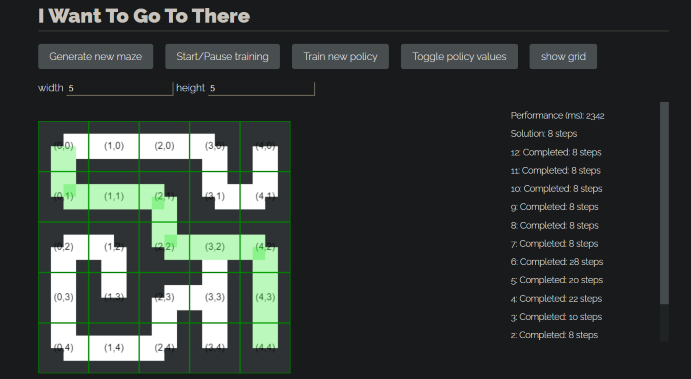
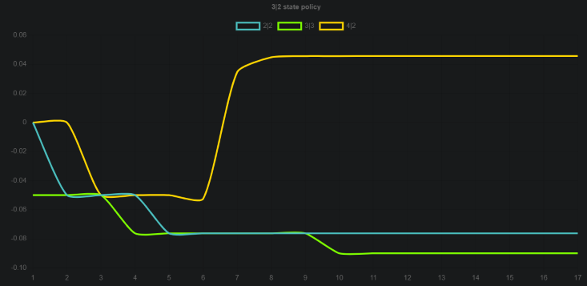

[Github原项目地址](https://github.com/rolyatmax/maze)

增加的内容: 
- 优化迷宫生成算法
- 增加策略梯度算法
- 用chart.js添加抉择点的动作价值折线图
- 添加网格及其显示隐藏按钮
- 可设置迷宫尺寸的input标签
 
```
npm install
npm run build
open index.html
```
迷宫外观:



动作价值折线图:



[腾讯云服务器地址](http://101.35.83.33:8888/maze.html)


